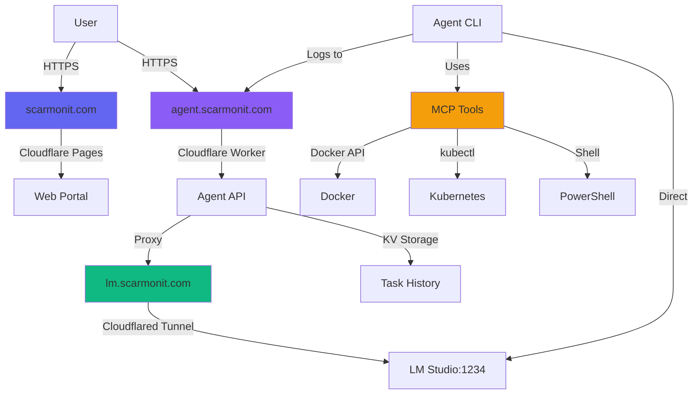

# Scarmonit AI Infrastructure

> **Premium AI-powered infrastructure platform with autonomous agents, LLM integration, and edge computing**

[](https://scarmonit.com)
[](https://agent.scarmonit.com)
[](https://lm.scarmonit.com)

## 🌟 Overview

Scarmonit is a comprehensive AI infrastructure platform featuring:

- 🤖 **Autonomous AI Agents** with MCP tool access
- 🌐 **Premium Web Portal** with modern UI/UX
- ⚡ **Edge API** via Cloudflare Workers
- 🧠 **Local LLM** integration with LM Studio
- 🐳 **Infrastructure Management** (Docker + Kubernetes)

## 📁 Project Structure

```
Scarmonit-Architecture/
├── web-portal/          # Premium landing page (scarmonit.com)
│   ├── index.html       # Main HTML
│   ├── styles.css       # Modern dark theme with animations
│   └── script.js        # Interactive features
│
├── agent-api/           # Cloudflare Worker (agent.scarmonit.com)
│   ├── src/
│   │   └── index.ts     # Worker entry point
│   └── wrangler.toml    # Worker configuration
│
├── agent-cli/           # AI Agent CLI with MCP tools
│   ├── agent.py         # Main agent worker
│   ├── mcp_client.py    # MCP tool interface
│   └── README.md        # CLI documentation
│
└── docs/                # Documentation
    ├── README.md        # This file
    ├── DEPLOYMENT.md    # Deployment guide
    └── ARCHITECTURE.md  # System architecture
```

## 🚀 Quick Start

### Prerequisites

- **Node.js** 22+ (for Cloudflare Workers)
- **Python** 3.13+ (for AI agents)
- **LM Studio** (for local LLM)
- **Docker** + **Kubernetes** (optional, for agent tools)
- **Wrangler CLI** (Cloudflare deployment)

### 1. Deploy Web Portal

```bash
cd web-portal
wrangler pages deploy . --project-name=scarmonit-www
```

### 2. Deploy Agent API

```bash
cd agent-api
wrangler deploy --env production
```

### 3. Run Agent CLI

```bash
cd agent-cli
python agent.py "List all Docker containers"
```

## 🌐 Live Endpoints

| Service | URL | Purpose |
|---------|-----|---------|
| **Web Portal** | [scarmonit.com](https://scarmonit.com) | Public landing page |
| **Agent Dashboard** | [agent.scarmonit.com](https://agent.scarmonit.com) | Task history & monitoring |
| **LM Studio API** | [lm.scarmonit.com](https://lm.scarmonit.com) | Local LLM endpoint |

## 🛠️ Components

### Web Portal

Modern, premium landing page with:
- 🎨 Dark theme with gradients & glassmorphism
- ✨ Smooth animations & particle effects
- 📱 Fully responsive design
- ⚡ Fast loading (< 2s)

**Tech Stack:** HTML5, CSS3 (Custom Properties), Vanilla JavaScript

### Agent API

Cloudflare Worker providing:
- 📊 Task history dashboard
- 🔄 OpenAI-compatible API proxy
- 💾 KV storage for task logs
- 🌍 Edge deployment worldwide

**Tech Stack:** TypeScript, Cloudflare Workers, KV Storage

### Agent CLI

Autonomous AI agent with:
- 🧠 LLM integration (LM Studio)
- 🔧 13 MCP tools (Docker, Kubernetes, Git, etc.)
- 🔁 ReAct reasoning loop
- 📝 Automatic task logging

**Tech Stack:** Python 3.13, Requests, MCP Protocol

## 🔧 MCP Tools Available

The agent can use:

### Infrastructure
- `docker_ps` - List Docker containers
- `docker_logs` - Get container logs
- `get_pods` - List Kubernetes pods
- `kubectl_logs` - Get pod logs

### File System
- `list_files` - Navigate directories
- `read_file` - Read file contents
- `write_file` - Write to files

### Version Control
- `git_status` - Repository status
- `git_log` - Commit history
- `git_diff` - Changes diff

### General
- `run_command` - Execute shell commands
- `fetch_url` - HTTP requests
- `web_search` - Web search

## 📖 Documentation

- [Deployment Guide](./DEPLOYMENT.md) - How to deploy all components
- [Architecture Overview](./ARCHITECTURE.md) - System design & flow
- [Agent CLI Guide](../agent-cli/README.md) - Using the AI agent
- [API Reference](./API.md) - Agent API endpoints

## 🎯 Usage Examples

### Run Agent Task

```bash
# List Docker containers
python agent-cli/agent.py "List all Docker containers"

# Check Kubernetes pods
python agent-cli/agent.py "List all Kubernetes pods"

# File operations
python agent-cli/agent.py "List files in /app"
```

### Access Dashboard

Visit [agent.scarmonit.com](https://agent.scarmonit.com) to:
- View recent agent tasks
- Check task execution history
- Monitor system status
- View detailed logs

### Use the API

```bash
# Health check
curl https://agent.scarmonit.com/health

# Get task history
curl https://agent.scarmonit.com/api/history

# Execute agent task (via OpenAI-compatible API)
curl -X POST https://agent.scarmonit.com/v1/chat/completions \
  -H "Content-Type: application/json" \
  -d '{"model":"lfm2-1.2b","messages":[{"role":"user","content":"Hello"}]}'
```

## 🏗️ Architecture



## 🔐 Security

- ✅ All endpoints use HTTPS/TLS
- ✅ Cloudflare WAF protection
- ✅ API authentication with Bearer tokens
- ✅ KV storage for sensitive data
- ✅ Local LLM (no data leaves your machine)

## 🚧 Development

### Setup Development Environment

```bash
# Clone/navigate to project
cd C:\Users\scarm\Scarmonit-Architecture

# Install Node dependencies (for worker)
cd agent-api
npm install

# Install Python dependencies (for agent)
cd ../agent-cli
pip install requests

# Install LM Studio
# Download from: https://lmstudio.ai
```

### Local Testing

```bash
# Test web portal locally
cd web-portal
python -m http.server 8000

# Test worker locally
cd agent-api
wrangler dev

# Test agent locally
cd agent-cli
python agent.py "test task"
```

## 📦 Deployment

See [DEPLOYMENT.md](./DEPLOYMENT.md) for detailed deployment instructions.

Quick deploy:

```bash
# Deploy everything at once
./deploy-all.sh  # Coming soon!
```

## 🤝 Contributing

This is a personal infrastructure project, but feel free to use it as inspiration!

## 📝 License

MIT License - See LICENSE file for details

## 🎯 Roadmap

- [ ] Add multi-model support to agent
- [ ] Implement streaming responses
- [ ] Add chat interface to dashboard
- [ ] Deploy Terraform/AWS MCP servers
- [ ] Add metrics & analytics
- [ ] Create deployment automation scripts

## 💡 Notes for AI Assistants

This project is designed to be AI-friendly:

- **Clear structure** - Each component in its own directory
- **Comprehensive docs** - README in every folder
- **Standard tooling** - npm, pip, wrangler
- **Type safety** - TypeScript for Worker, type hints in Python
- **Deployment ready** - All configs included

To help with this project:
1. Check relevant component README first
2. Use standard commands (npm, pip, wrangler)
3. Follow existing code style
4. Update docs when making changes
5. Test locally before deploying

## 📞 Support

For issues or questions:
- Check [ARCHITECTURE.md](./ARCHITECTURE.md) for system design
- Review [DEPLOYMENT.md](./DEPLOYMENT.md) for deployment help
- View agent logs in dashboard at [agent.scarmonit.com](https://agent.scarmonit.com)

---

**Built with ❤️ using AI-powered development**

Last Updated: November 28, 2025
